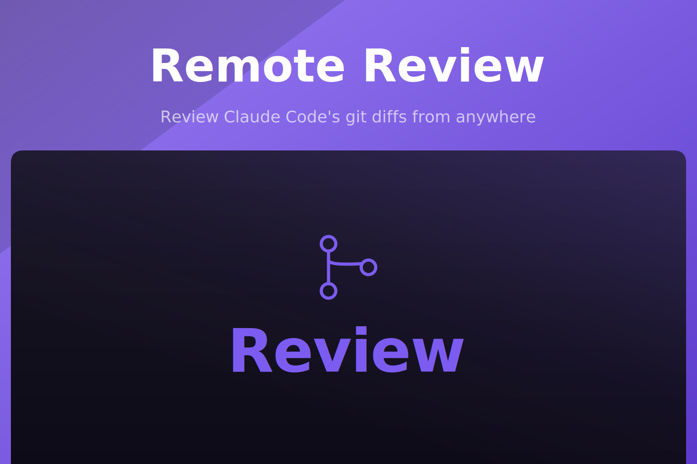

<p align="center">
  
</p>

<p align="center">
  <a href="https://www.npmjs.com/package/remote-review"></a>
  <a href="https://www.npmjs.com/package/remote-review"></a>
  <a href="https://github.com/akira-io/remote-review/actions/workflows/ci.yml"></a>
  
  
</p>

Review Claude Code's git diffs from anywhere via a shareable tunnel link, and send comments straight
back to the agent, with no PR required. Built for **dispatch mode** (non-interactive / `--print` /
background sessions), where you are not sitting in front of the terminal running the agent. Inspired
by [difit](https://github.com/yoshiko-pg/difit), which solves this for local, same-machine review;
`remote-review` adds the tunnel, so the review page works from your phone or another machine and
blocks the agent's turn until you have actually looked at the diff.

```
┌──────────────────────────────┐
│ Claude Code (dispatch mode)   │
│  finishes a task              │
│  runs: remote-review .        │──┐
└──────────────────────────────┘  │
                                    ▼
                     starts local server + cloudflared tunnel
                     prints https://xyz.trycloudflare.com
                                    │
                                    ▼
                     you open the link on your phone,
                     read the diff, leave inline comments,
                     tap "Send to Claude"
                                    │
                                    ▼
                     CLI unblocks, prints comments to stdout,
                     Claude Code reads them as its tool result
                     and addresses the feedback
```

## Install

```sh
# npm
npm install -g remote-review

# pnpm
pnpm add -g remote-review

# yarn
yarn global add remote-review

# bun
bun add -g remote-review
```

Or run it without installing:

```sh
npx remote-review .
```

You also want [`cloudflared`](https://github.com/cloudflare/cloudflared/releases) on your `PATH` for
remote links. It needs no account or config; it uses anonymous quick tunnels. Without it,
`remote-review` still works, local-only.

```sh
# macOS
brew install cloudflared

# Linux: grab the binary from the releases page above, or use your
# distro's package manager if it ships one
```

Requires Node.js `>=18.0.0`.

## Quick start

In any git repo with changes:

```sh
cd ~/projects/my-app
remote-review .
```

The command prints a **Local:** URL (same machine) and, if cloudflared is installed, a **Remote:**
URL (phone or another device). Your browser opens the local page automatically.

1. Open the review page — use **Remote:** on your phone, or follow the auto-opened local tab.
2. Read the diff and click **+** on any line to leave a comment.
3. Tap **Send to Claude**, or **Finish (no comments)** to approve with no feedback.

On submit, the CLI unblocks and prints your comments to stdout:

```
src/api/handler.ts:L18
This should probably validate input before writing to disk
```

If nothing was submitted, it prints `Review finished with no comments.` instead. If submit fails
(for example the tunnel dropped), use the **Copy** button on the page and paste the comments into
your agent manually.

Local-only, no tunnel:

```sh
remote-review . --no-tunnel
```

## Documentation

There is no hosted API reference: `remote-review` is a CLI with no library surface. Everything is
documented here and in [`skills/remote-review/SKILL.md`](skills/remote-review/SKILL.md).

### Targets

```sh
remote-review .              # all uncommitted changes (most common in dispatch mode)
remote-review                # HEAD's latest commit
remote-review staged         # staged changes only
remote-review working        # unstaged changes only
remote-review main           # a specific ref vs its parent
remote-review feature main   # compare two refs
```

The command **blocks** until you submit a review, or close the tab having decided there is nothing
to say.

### Options

| Flag | Default | Description |
| --- | --- | --- |
| `-p, --port <port>` | random free port | Local port to bind |
| `--no-tunnel` | tunnel on | Skip cloudflared, local-only |
| `--host <host>` | `127.0.0.1` | Host to bind the local server to |
| `-C, --cwd <path>` | cwd | Run against a different repo path |
| `--context <lines>` | git default | Context lines around each change |
| `--timeout <seconds>` | none | Give up waiting after N seconds |
| `--no-open` | opens browser | Do not auto-open the local URL |

### Using it from Claude Code

Copy `skills/remote-review` into your agent's skills directory so Claude Code knows when and how to
reach for it during dispatch sessions:

```sh
cp -r skills/remote-review ~/.claude/skills/   # adjust to your actual skills path
```

The skill tells Claude Code to run `remote-review .` after finishing meaningful work in a
non-interactive session, share the printed `Remote:` URL with you, and treat the stdout it gets back
as review feedback to act on.

### How it differs from difit

- **Tunneled by default**: a fresh `cloudflared` quick tunnel per invocation, torn down when the
  review is submitted, so the link works from any device without VPN or SSH setup.
- **Token-gated**: the tunnel URL alone is not enough; a random token is required, so a leaked or
  logged URL without the token query param does not expose the diff.
- **Built for the blocking-CLI-call contract**, so it drops into an agent's tool-call loop the same
  way difit does, just reachable remotely.
- Everything else (diff parsing, comment UX, prompt format) intentionally mirrors difit's model.

### Security model

- Each session generates a random token; without it, `/api/diff` and `/api/submit` return `403`.
- The tunnel is anonymous and unauthenticated beyond that token, so treat the link as a bearer
  credential and do not paste it somewhere public.
- The server accepts exactly **one** submission per invocation, then the process exits and the
  tunnel is torn down.
- `remote-review` never writes to your repo and never executes anything on your behalf; it reads
  diffs and returns text.

## Testing

```sh
npm test
```

Local development, no build step, just a plain Express backend and a dependency-free vanilla-JS
frontend:

```sh
git clone https://github.com/akira-io/remote-review.git
cd remote-review
npm install
npm test
node bin/remote-review.js . --cwd /path/to/some/repo --no-tunnel
```

## Changelog

Please see [CHANGELOG.md](CHANGELOG.md) for what has changed recently. The changelog is generated
from conventional commits via [git-cliff](https://git-cliff.org) on every release tag.

## Contributing

Please see [CONTRIBUTING.md](CONTRIBUTING.md) for details.

## Security Vulnerabilities

Please review [our security policy](SECURITY.md) on how to report security vulnerabilities.

## Credits

- [liedsonc](https://github.com/liedsonc)
- [All Contributors](https://github.com/akira-io/remote-review/graphs/contributors)

## License

MIT License ([LICENSE](LICENSE) or https://opensource.org/licenses/MIT).

Unless you explicitly state otherwise, any contribution intentionally submitted for inclusion in
this project by you shall be licensed as above, without any additional terms or conditions.
